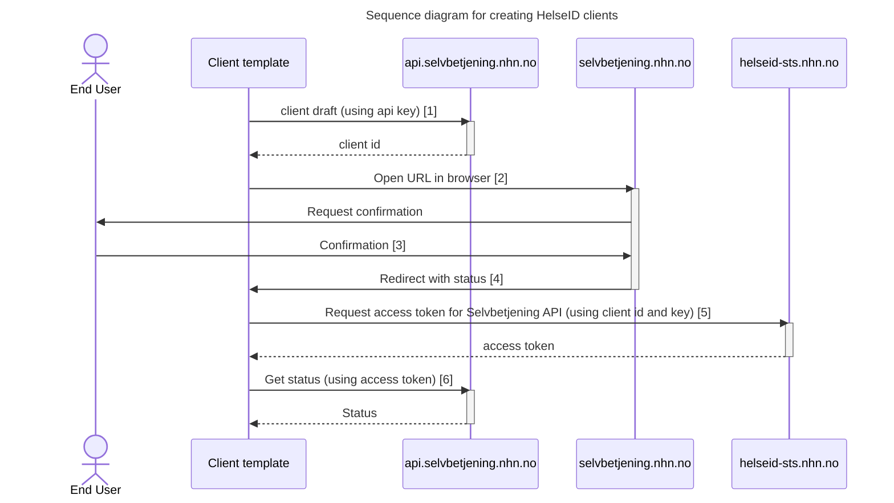

# Getting started

This repository contains two sample implementations for using the [Selvbetjening for HelseID API](https://api.selvbetjening.test.nhn.no/):
1. Create HelseID clients
2. Updating HelseID clients

Full API docs can be found in [Selvbetjening for HelseID](https://selvbetjening.test.nhn.no/docs/api).

# Create HelseID clients
***Note: The API does not support creating multi-tenant or single-tenant clients.***


1. Create a client draft using the API
2. Direct the end user to the confirmation page at [Selvbetjening for HelseID](https://selvbetjening.test.nhn.no) in a browser
3. The end user confirms the client
4. The browser redirects to your local http server
5. With a successful status, you can request access tokens from HelseID
6. Check the status of the client's access to the specified scopes

## Client template

A client template must be created in **[Selvbetjening for HelseID ](https://selvbetjening.test.nhn.no/)**

For this sample implementation you need to enable user login and enable support for refresh tokens. It's also important to specify which APIs are supported by the system. 
The redirect URI should be set to `http://localhost:1337/callback` when using the default config.

After the client system has been created, navigate to the 'Automation' tab, and generate an API key:


Move into [appsettings.json](https://github.com/NorskHelsenett/Selvbetjening.Samples/blob/main/ClientRegistrationExample/appsettings.json), and paste the API key. This key is used for authenticating against the [client drafts endpoint](https://ext.selvbetjening.test.nhn.no).

```
{
  ...
  "Selvbetjening": {
    ...
    "ClientDraftApiKeyHeader": "api-key",
    "ClientDraftApiKey": "[PASTE here]"
  }
  ...
}
```

## Creating the client draft

Follow the sample code in [ClientRegistrationExample](https://github.com/NorskHelsenett/Selvbetjening.Samples/tree/main/ClientRegistrationExample)

1. Create the client draft using the `client-drafts` endpoint
2. Direct the end user to Selvbetjening for HelseID: `/confirm-client/<client_id>`, where `<client_id>` is the ID of the client draft
3. Check the status of the client's access to the specified scopes
4. Authenticate the end user and request access tokens for the specified APIs
5. You're ready to go

# Updating HelseID clients

Follow the sample code in [ClientUpdateExample](https://github.com/NorskHelsenett/Selvbetjening.Samples/tree/main/ClientUpdateExample)

There are two separate endpoints for updating the client:

1. Updating the client secret
2. Updating the rest of the client configuration

The update operation will affect all properties in the payload as submitted. If a property is set to null in the payload, the property **will not** be ignored and will be updated in the client configuration.

### Example for redirect uris:

If you want to add a redirect uri, you also need to submit the previous redirect uris, along with the rest of the relevant data for the client configuration.  
If you want to delete a redirect uri, remove it from the array and call the update endpoint with the rest of the data.  
If you set redirect uris to be null, the update will fail if the client system isn't configured to use the same redirect uris for all client configurations.
